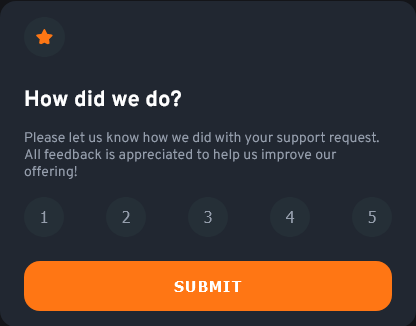

## Frontend Mentor - Interactive rating component

Another project completed. This included some JavaScript as well. Was quite a fun and simple project. Have added a little extra to make it a little more fun. You should choose some number before clicking the submit button. Otherwise, it will not proceed.
Feel free to try it at [Netlify.com](https://stalwart-horse-a510c8.netlify.app/)
